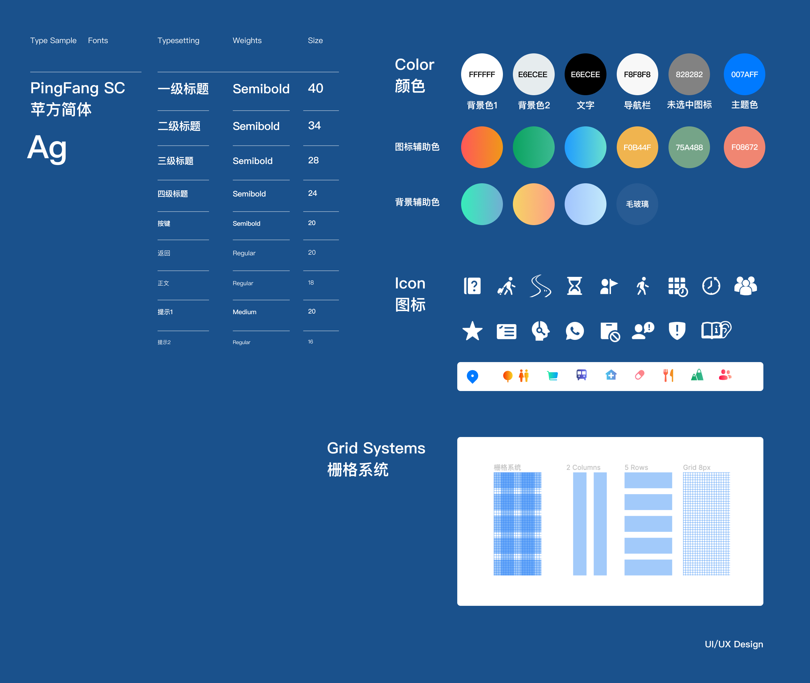

### Project Overview: Sunset Travel – A Senior-Friendly Travel App

#### 🔗 Interactive Demo  👉 [View the Sunset Travel interactive prototype](https://www.figma.com/proto/tfDTMCU6H5HDU252h8YQwm/%E4%BA%A4%E4%BA%92%E5%8E%9F%E5%9E%8B?page-id=0%3A1&node-id=1-14&viewport=4058%2C545%2C1&scaling=min-zoom&starting-point-node-id=1%3A14&show-proto-sidebar=1)

Amid the rapid rise of the digital age, elderly users are actively embracing online life but continue to face a significant digital divide. Slower post-retirement lifestyles and reduced social interaction often lead to feelings of emptiness and lack of purpose. As a result, many senior users seek a “spiritual refuge” and aspire to stay connected with mainstream society.

This project explores the feasibility and necessity of a travel app designed specifically for the elderly by identifying common pain points they encounter when using mobile applications. The work completed includes:  

(1) analysing business and market needs to extract key user experience requirements;  
(2) conducting user analysis based on age-friendly design principles to define product goals, core functionalities, and design strategies;  
(3) gathering feedback for continuous optimisation and design iteration.  

The final product is grounded in the needs of the elderly, with comprehensive design across four key dimensions: positioning, functionality, interaction, and visual style. This project offers a new perspective on how digital products can better serve a currently underserved demographic.  

---

### POST

---

### UI Design

---

### User Persona  

---
### Flowchart

---

### User Insights & Design Rationale

Through surveys and interviews with elderly users, we found that many seniors are passionate about travel and eager to step outside to broaden their horizons and experience new landscapes. However, several barriers prevent them from doing so, such as a lack of knowledge about booking procedures, unavailability of family companions, and concerns about personal safety. Although many travel apps have introduced senior-friendly modes, these often fall short — offering overly simplified features or maintaining complex logic that still hinders usability. A subconscious fear of venturing out further weakens their willingness to travel.  

To address these issues, Sunset Travel introduces three one-click travel options and a simplified DIY travel path that guides elderly users through linear, easy-to-understand booking steps while automatically generating detailed travel schedules. We also implemented safety assurance features and real-time travel support to reduce anxiety and enhance security. Additionally, the app includes social features to help users expand their networks, breaking the dependency on family members for companionship during trips.  

Throughout the design, we carefully balanced simplifying processes with meeting user needs — offering as much autonomy as possible while enhancing usability through thoughtful visual design. This age-friendly travel app aims to reduce loneliness and anxiety, helping to bridge the digital divide and reconnect elderly users with the wider world.

